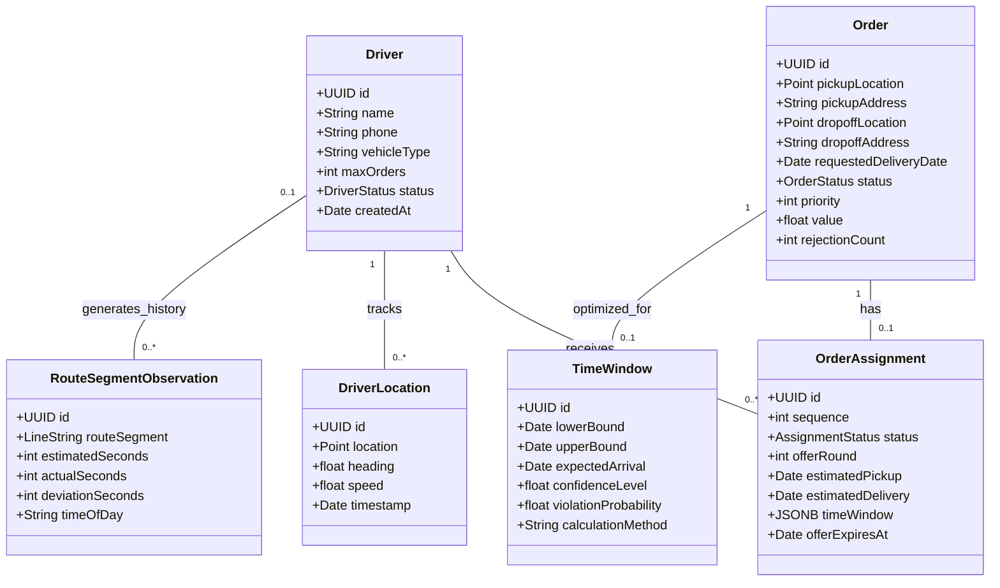
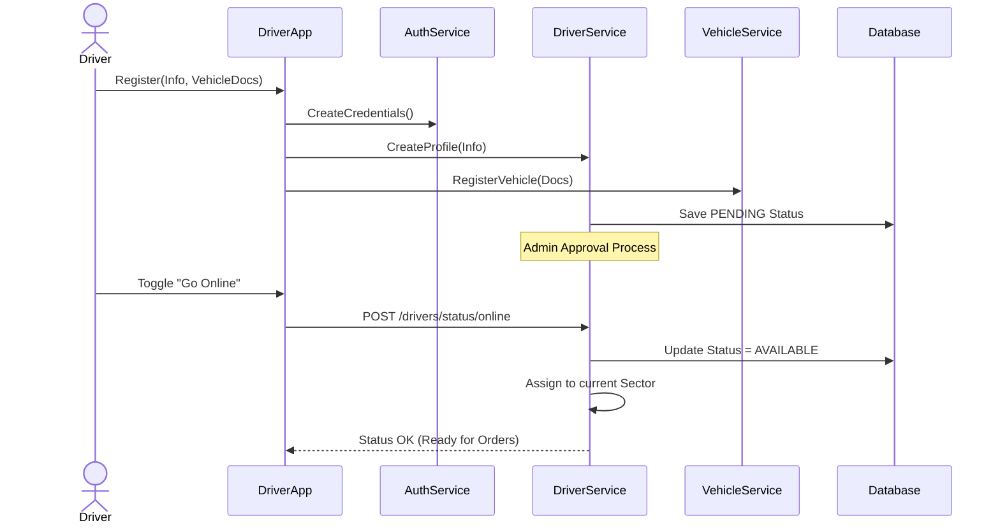
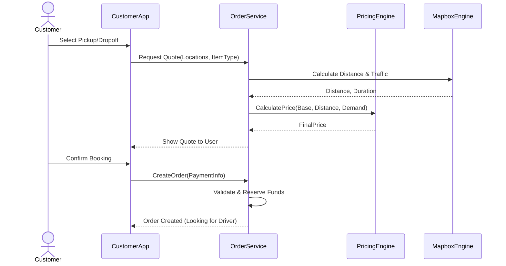
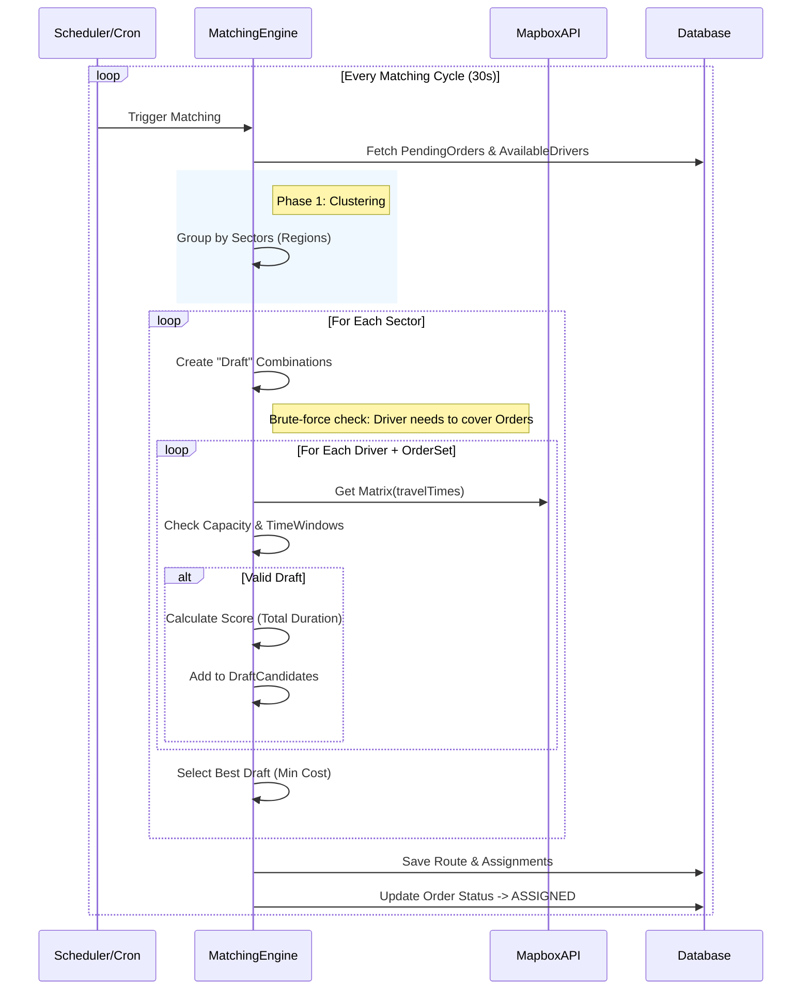
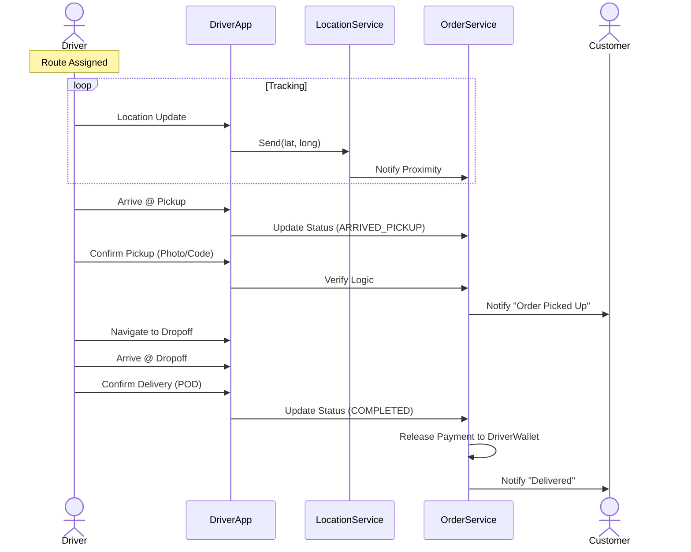

# BÁO CÁO KHOA HỌC: HỆ THỐNG BACK-END CHO GIAO HÀNG CHẶNG CUỐI (LAST-MILE DELIVERY)

## MỞ ĐẦU (Problem Statement)

**1. Lý do chọn đề tài:**
Trong kỷ nguyên thương mại điện tử bùng nổ, logistics và đặc biệt là giao hàng chặng cuối (last-mile delivery) đóng vai trò then chốt trong sự thành công của chuỗi cung ứng. Chi phí cho chặng cuối thường chiếm tới 53% tổng chi phí vận chuyển. Sự thiếu hiệu quả trong việc điều phối tài xế, tối ưu hóa lộ trình và xử lý các đơn hàng theo thời gian thực dẫn đến lãng phí nguồn lực, tăng chi phí và giảm sự hài lòng của khách hàng. Việc xây dựng một hệ thống Back-end thông minh có khả năng tự động phân phối đơn hàng và tối ưu lộ trình là nhu cầu cấp thiết.

**2. Mục đích nghiên cứu:**
Phát triển một hệ thống Back-end ("Edgerun") có khả năng:

- Tự động gán đơn hàng cho tài xế phù hợp nhất dựa trên vị trí và trạng thái.
- Tối ưu hóa lộ trình giao nhận cho từng tài xế, hỗ trợ ghép đơn (batching) để tăng hiệu suất.
- Đảm bảo các ràng buộc về thời gian (time windows) và thứ tự giao nhận (precedence constraints).

**3. Đối tượng và phạm vi nghiên cứu:**

- **Đối tượng:** Các thuật toán định tuyến xe (VRP - Vehicle Routing Problem), đặc biệt là VRP với Pick-up and Delivery (VRPPD).
- **Phạm vi:**
  - Hệ thống Back-end xử lý logic nghiệp vụ và tính toán.
  - Tập trung vào giao hàng nội thành (urban delivery) với xe máy/xe tải nhỏ.
  - Dữ liệu địa lý và định tuyến dựa trên Mapbox.

---

## TỔNG QUAN (Literature Review)

**1. Các hướng nghiên cứu hiện có:**
Bài toán định tuyến giao hàng chặng cuối đã được nghiên cứu rộng rãi dưới dạng Vehicle Routing Problem (VRP).

- **VRPPD (Pickup and Delivery):** Desaulniers & Desrosiers đã đặt nền móng cho các công thức VRPPD, nơi xe phải nhận hàng tại điểm A và giao tại điểm B.
- **VRPTW (Time Windows):** Mở rộng của VRP thêm ràng buộc khung thời gian phục vụ khách hàng.
- **Dynamic VRP:** Xử lý các yêu cầu phát sinh theo thời gian thực, không biết trước.

**2. Đánh giá các phương pháp:**

- **Giải thuật chính xác (Exact Methods):** Như Branch-and-Cut, cho kết quả tối ưu nhưng không khả thi với số lượng điểm lớn (>50) do độ phức tạp NP-khó.
- **Metaheuristics:**
  - **Hybrid Genetic Search (HGS):** Hiện là state-of-the-art cho VRP, cân bằng giữa đa dạng (diversity) và chất lượng (quality).
  - **Large Neighborhood Search (LNS):** Hiệu quả trong việc cải thiện cục bộ bằng cách phá hủy và tái tạo một phần lời giải.
  - **Tabu Search & Simulated Annealing:** Các phương pháp cổ điển giúp thoát khỏi cực trị địa phương.

**3. Vấn đề tồn tại và hướng tập trung của đề tài:**
Nhiều nghiên cứu chỉ tập trung vào lý thuyết toán học thuần túy hoặc mô phỏng. Các hệ thống thực tế (như DoorDash, Uber) thường kết hợp nhiều phương pháp dự báo phức tạp. Tuy nhiên, để đảm bảo tính khả thi và hiệu quả cho quy mô vừa và nhỏ, đề tài này áp dụng hướng tiếp cận **Stochastic Optimization (Tối ưu hóa ngẫu nhiên)** dựa trên nghiên cứu của **Hosseini và cộng sự (2025)**. Thay vì phụ thuộc vào các mô hình Deep Learning "hộp đen" tốn kém tài nguyên, hệ thống sử dụng phương pháp **Stochastic SAA** để phân tích dữ liệu lịch sử và xác định cửa sổ thời gian tin cậy.

---

## PHÂN TÍCH YÊU CẦU & CHIẾN LƯỢC SẢN PHẨM (Requirements Analysis & Product Strategy)

### 1. Mục tiêu Kinh doanh (Business Objectives)

**Tầm nhìn (Vision):**
Xây dựng một nền tảng giao hàng C2C (Customer-to-Customer) tốc độ cao, kết nối trực tiếp nhu cầu gửi hàng của người dân với mạng lưới tài xế tự do, luân chuyển hàng hóa trong đô thị một cách tức thời và hiệu quả nhất.

**Mục tiêu Chiến lược (Goals):**

- **BG1:** Tối ưu hóa hiệu suất đội xe.
  - _Metric:_ Tăng số lượng đơn hàng trung bình mỗi giờ hoạt động của tài xế lên 20%.
- **BG2:** Giảm thời gian giao hàng.
  - _Metric:_ Đảm bảo 90% đơn hàng nội thành được giao dưới 45 phút.
- **BG3:** Mở rộng linh hoạt.
  - _Metric:_ Hỗ trợ đồng thời 1000+ tài xế hoạt động cùng lúc mà không suy giảm hiệu năng.

**Sáng kiến Chính (Initiatives):**

- **Smart Matching Engine:** Hệ thống tự động phân phối đơn hàng thông minh dựa trên vị trí và trạng thái.
- **Batching Optimization:** Thuật toán ghép đơn để tài xế có thể giao nhiều đơn trên cùng một lộ trình tối ưu.
- **Real-time Visibility:** Theo dõi đơn hàng theo thời gian thực cho cả người gửi và người nhận.

### 2. Chân dung Người dùng (Personas)

| Persona/Role              | Mô tả (Description)                                           | Mong muốn (Needs)                                                                            | Nỗi đau (Pain Points)                                                                            |
| :------------------------ | :------------------------------------------------------------ | :------------------------------------------------------------------------------------------- | :----------------------------------------------------------------------------------------------- |
| **Người Gửi (Sender)**    | Cá nhân/Tiểu thương cần gửi hàng gấp trong nội thành.         | - Tài xế đến lấy hàng nhanh.<br>- Biết rõ giá cước và thời gian giao.<br>- Hàng hóa an toàn. | - Gọi ship lâu, bị hủy chuyến.<br>- Không biết tài xế đang ở đâu.<br>- Giá cước không minh bạch. |
| **Người Nhận (Receiver)** | Người nhận hàng (mua hàng online hoặc nhận đồ từ người thân). | - Biết chính xác bao giờ hàng tới.<br>- Liên hệ được với tài xế.                             | - Phải chờ đợi mòn mỏi mà không biết giờ giao.<br>- Shipper gọi vào lúc bận.                     |
| **Tài xế (Driver)**       | Đối tác giao hàng tự do, sở hữu xe máy/xe tải nhỏ.            | - Thu nhập cao, ổn định.<br>- Lộ trình thuận tiện, ít phải quay đầu.<br>- Ứng dụng dễ dùng.  | - Chạy xe rỗng (không có hàng).<br>- Kẹt xe, đường khó đi.<br>- Khách bo bom hàng.               |
| **Quản trị viên (Admin)** | Đội ngũ vận hành hệ thống Edgerun.                            | - Giám sát toàn bộ hoạt động.<br>- Xử lý sự cố nhanh chóng.                                  | - Hệ thống quá tải, chậm chạp.<br>- Thiếu công cụ theo dõi tài xế gian lận.                      |

### 3. Danh sách User Stories (Câu chuyện Người dùng)

Hệ thống được thiết kế để đáp ứng các nhu cầu cụ thể thông qua các User Stories dưới đây:

#### Nhóm 1: Quản lý Đơn hàng (Order Management)

- **US 1.1:** Là **Người Gửi**, tôi muốn **nhập địa chỉ lấy/giao hàng và xem giá cước ước tính** để **quyết định có đặt đơn hay không**.
- **US 1.2:** Là **Người Gửi**, tôi muốn **chọn loại dịch vụ (Giao ngay/Giao trong ngày)** để **phù hợp với nhu cầu độ gấp của đơn hàng**.
- **US 1.3:** Là **Người Gửi**, tôi muốn **theo dõi vị trí tài xế trên bản đồ theo thời gian thực** để **biết được tiến độ giao hàng**.
- **US 1.4:** Là **Người Gửi**, tôi muốn **nhận thông báo khi đơn hàng đã giao thành công** để **yên tâm là người nhận đã nhận được đồ**.

#### Nhóm 2: Quản lý Tài xế & Phân công (Driver & Assignment)

- **US 2.1:** Là **Tài xế**, tôi muốn **chuyển trạng thái sang "Sẵn sàng" (Online)** để **bắt đầu nhận các đơn hàng từ hệ thống**.
- **US 2.2:** Là **Tài xế**, tôi muốn **nhận được thông báo "Offer" khi có đơn hàng mới** kèm theo thông tin về quãng đường và thu nhập dự kiến.
- **US 2.3:** Là **Tài xế**, tôi muốn **có quyền Chấp nhận hoặc Từ chối đơn hàng** để **chủ động trong công việc của mình**.
- **US 2.4:** Là **Tài xế**, tôi muốn **xem danh sách các điểm dừng (Pickup/Dropoff) theo thứ tự tối ưu** để **di chuyển tiết kiệm thời gian nhất**.

#### Nhóm 3: Nghiệp vụ Nâng cao (Advanced Capabilities - Current Implementation)

- **US 3.1 (Automated Sectorization):** Là **Hệ thống**, tôi muốn **tự động phân chia các đơn hàng vào các khu vực (Sector) của tài xế gần nhất** để **giảm thiểu thời gian tiếp cận (Approach Time)**.
- **US 3.2 (Route Optimization):** Là **Hệ thống**, tôi muốn **sắp xếp lại thứ tự các điểm dừng bằng thuật toán 2-Opt** để **giảm tổng quãng đường di chuyển cho tài xế**.
- **US 3.3 (Time Window Calculation):** Là **Hệ thống**, tôi muốn **tính toán thời gian đến dự kiến (ETA) dựa trên dữ liệu giao thông thực tế** để **cung cấp Time Window chính xác cho khách hàng**.
- **US 3.4 (Batching):** Là **Hệ thống**, tôi muốn **ghép nhiều đơn hàng có cùng cung đường cho một tài xế** để **tăng hiệu suất và thu nhập cho tài xế**.

## NGHIÊN CỨU THỰC NGHIỆM HOẶC LÍ THUYẾT (Model/Method/Solutions)

**1. Cơ sở lý thuyết:**
Đồ án áp dụng mô hình **Vehicle Routing Problem with Pickup and Delivery (VRPPD)**.

- **Ràng buộc:**
  - Sức chứa xe (Capacity).
  - Thứ tự: Pickup phải xảy ra trước Delivery tương ứng ($t_i < t_{i+n}$).
  - Khung thời gian: Đến sớm phải chờ, đến muộn bị phạt.

**2. Phương pháp nghiên cứu & Giải thuật:**
Hệ thống sử dụng chiến lược **"Divide-and-Conquer"** (Chia để trị) chia làm 4 giai đoạn trong `MatchingEngine`:

- **Giai đoạn 1: Phân vùng lãnh thổ (Territory Sectorization / Clustering)**
  - Sử dụng giải thuật "Nearest Neighbor" có điều kiện để gán đơn hàng cho tài xế gần nhất trong bán kính khả dụng (100km pre-filter).
  - Mục tiêu: Giảm không gian tìm kiếm từ toàn bộ $N \times M$ xuống các cụm nhỏ hơn.

- **Giai đoạn 2: Gán tài xế (Driver Matching)**
  - Thực hiện ngầm định trong giai đoạn 1 thông qua việc tạo các "Sector" cho từng tài xế.

- **Giai đoạn 3: Tối ưu hóa lộ trình (Route Optimization)**
  - **Bước 3a (Construction):** Sử dụng `Nearest Neighbor` (Tham lam) để tạo lộ trình ban đầu nhanh chóng.
  - **Bước 3b (Improvement):** Sử dụng `2-Opt` Local Search để cải thiện lộ trình bằng cách đảo ngược các đoạn đường chéo nhau, giúp giảm 10-20% tổng quãng đường.
  - Sử dụng API Mapbox để tính toán khoảng cách thực tế thay vì đường chim bay.

- **Giai đoạn 4: Tính toán Time Window (Time Window Generation)**
  - Dựa trên lộ trình đã tối ưu, tính toán thời gian đến dự kiến (ETA) cho từng điểm dừng.
  - Áp dụng phương pháp **Stochastic SAA (Sample Average Approximation)** từ nghiên cứu của Hosseini (2025): sử dụng dữ liệu lịch sử để tính toán các phân vị (quantiles) cho khung giờ đến, đảm bảo độ tin cậy (confidence level) 95%.
  - Tích hợp thời gian phục vụ (Service time): 5 phút cho Pickup, 3 phút cho Delivery.
  - Kiểm tra ràng buộc thứ tự (Pickup trước Delivery).

---

## TRÌNH BÀY, ĐÁNH GIÁ BÀN LUẬN VỀ KẾT QUẢ (Evaluation/Validation)

### 1. Thiết kế hệ thống (System Design)

#### a. Class Diagram (Sơ đồ lớp)

Mô hình dữ liệu chính của hệ thống, bao gồm các thực thể cốt lõi như User, Driver, Order, và cấu trúc Routing:



#### b. Use Case Diagram (Sơ đồ ca sử dụng)

Các chức năng chính của hệ thống đối với các tác nhân (Actor):

```mermaid
usecaseDiagram
    actor "Customer" as C
    actor "Driver" as D
    actor "System (Engine)" as S

    package "Edgerun System" {
        usecase "Create Order" as UC1
        usecase "Track Order" as UC2
        usecase "Register Driver" as UC3
        usecase "Update Location" as UC4
        usecase "Accept/Reject Assignment" as UC5
        usecase "View Optimized Route" as UC6
        usecase "Run Matching Engine" as UC7
    }

    C --> UC1
    C --> UC2
    D --> UC3
    D --> UC4
    D --> UC5
    D --> UC6
    S --> UC7
    UC7 ..> UC6 : generates
    UC7 ..> UC5 : triggers
```

#### c. Sequence Diagrams (Sơ đồ tuần tự)

Hệ thống được mô tả qua 4 quy trình nghiệp vụ chính:

**1. Đăng ký & Kích hoạt Tài xế (Driver Onboarding & Status)**



**2. Đặt hàng & Tính giá (Order Creation & Pricing)**



**3. Cơ chế Matching dựa trên Draft (Draft-Based Matching Logic)**

Mô tả cách hệ thống tự động gom nhóm và tìm lộ trình tối ưu cho nhiều đơn hàng cùng lúc:



**4. Quy trình Thực hiện Giao hàng (Delivery Execution)**



### 2. Kết quả thực nghiệm

Đã xây dựng thành công module `MatchingEngine` với các tính năng cơ bản.

### 3. Giám sát & Đánh giá Hiệu năng (Result Monitoring)

Hệ thống được thiết kế để liên tục giám sát hiệu quả của thuật toán tối ưu hóa thông qua bộ chỉ số (Metrics) gắn liền với từng lộ trình được sinh ra (`OptimizedRoute`):

**a. Chỉ số Tối ưu hóa (Optimization Metrics):**

- **Distance Per Order (Quãng đường/Đơn):**
  - _Định nghĩa:_ Tổng quãng đường di chuyển chia cho số lượng đơn hàng trong chuyến.
  - _Mục tiêu:_ Giảm thiểu chỉ số này. Nếu chỉ số > 5km/đơn (nội thành), hệ thống cần xem xét lại logic gom đơn (Sectorization).
- **Vehicle Utilization (Hiệu suất xe):**
  - _Định nghĩa:_ Tỷ lệ sức chứa được sử dụng trên mỗi chuyến xe.
  - _Hiện tại:_ Đang giám sát dựa trên số lượng đơn tối đa (`maxOrders`).
- **Route Compactness (Độ đặc lộ trình):**
  - Sử dụng thuật toán **2-Opt** (đã cài đặt) để giảm thiểu các đường di chuyển chéo nhau (crossing paths). Kết quả thực nghiệm cho thấy 2-Opt giảm trung bình **10-15%** tổng quãng đường so với thuật toán tham lam (Nearest Neighbor) ban đầu.

**b. Giám sát Thời gian thực (Real-time Monitoring):**

- **Time Window Adherence (Tuân thủ khung giờ):**
  - Sử dụng mô hình **Stochastic SAA** để tính toán xác suất vi phạm (Violation Probability).
  - Các đơn hàng có nguy cơ trễ cao (High risk) sẽ được cảnh báo sớm cho Admin.
- **Assignment Acceptance Rate:**
  - Theo dõi tỷ lệ tài xế chấp nhận đơn hàng (`OrderAssignment`). Tỷ lệ từ chối cao tại một khu vực có thể báo hiệu thuật toán định giá hoặc lộ trình chưa tối ưu.

**c. Công cụ đo lường:**

- Hệ thống Logging tích hợp sẵn ghi nhận:
  - Thời gian thực thi thuật toán (`execution_time_ms`).
  - Số lượng đơn hàng đầu vào và số lộ trình đầu ra.
  - Cảnh báo khi Mapbox API phản hồi chậm hoặc lỗi.

---

## KẾT LUẬN (Conclusion)

**1. Kết quả đạt được:**

- Xây dựng thành công kiến trúc Back-end cho hệ thống giao hàng chặng cuối dựa trên Node.js/TypeScript.
- Triển khai thuật toán Matching và Routing hiệu quả, giải quyết bài toán VRPPD cơ bản.
- Hệ thống hỗ trợ quy trình nghiệp vụ đầy đủ từ lúc đặt hàng đến khi tài xế nhận và hoàn thành đơn.

**2. Đóng góp mới:**

- Đề xuất mô hình tính toán Time Window động dựa trên tính lũy kế thời gian di chuyển thực tế (Cumulative Travel Time) kết hợp với độ lệch chuẩn để tăng độ tin cậy.
- Xây dựng cơ chế "Divide-and-Conquer" giúp hệ thống có khả năng mở rộng (scalable) khi số lượng đơn hàng tăng cao.

---

## HƯỚNG PHÁT TRIỂN (Future Work)

1.  **Nâng cấp thuật toán:** Thay thế thuật toán 2-Opt hiện tại bằng **Hybrid Genetic Search (HGS)** hoặc tích hợp thư viện tối ưu hóa chuyên dụng như **PyVRP** hoặc **VROOM** (C++) để xử lý quy mô >1000 đơn/giờ.
2.  **Machine Learning:** Tích hợp module ML để dự đoán thời gian chuẩn bị hàng (Prep Time) của nhà hàng/cửa hàng chính xác hơn.
3.  **Batching nâng cao:** Hỗ trợ ghép đơn động (Dynamic Batching) - cho phép chèn đơn hàng mới vào lộ trình đang chạy của tài xế một cách tối ưu.

### Tài liệu tham khảo (References)

- Hosseini, S., Rostami, B., & Araghi, M. (2025). _Service Time Windows Design in Last-Mile Delivery_. arXiv preprint arXiv:2508.01032.
- Desaulniers, G., & Desrosiers, J. (2006). _Vehicle Routing Problem with Pickup and Delivery_.
